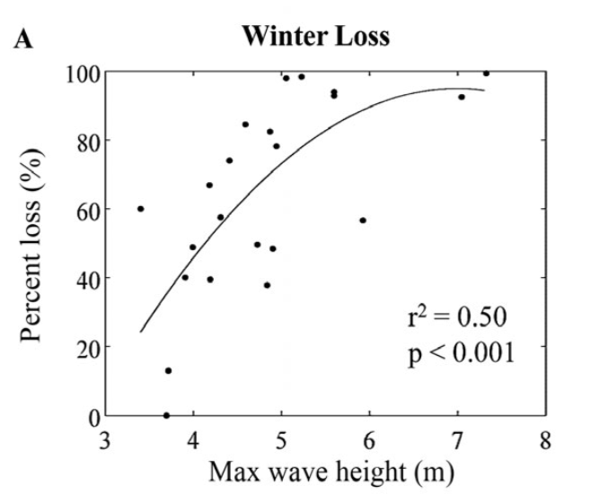

<h3> What is the app?</h3>
This shiny application was created to visualize Giant kelp (*Macrocystis pyrifera*) biomass percent loss in southern California. 

This app allows users to interatively explore annual and monthly kelp average biomass loss and average kelp biomass in historic leasable kelp harvest beds as well as visualize heatmaps of annual and monthly expected kelp biomass loss.  Giant kelp (Macrocystis pyrifera) biomass percent loss has been non-linearly related (Cavanaugh et. al 2011) to significant wave height using data from  winter storms in the Santa Barbara Channel.

<h3> How do I use it?</h3>
Navigate through the app by clicking on the tabs at the top. Each tab provides further directions and additional information. 
* **California Kelp Biomass Explorer**: This interactive map tab allows the user to view historic kelp beds, and toggle through layers of on Current Kelp Biomass, Kelp Percent Biomass Loss, and Kelp Persistence. Sections of the historic kelpbeds are clickable to display biomass in fresh canopy kg, line graphs of monthly and annually averaged biomass loss, and proportional kelp persistence through time. 
* **Kelp Biomass Loss per Month** : Use the radio buttons on this tab to select annual or the desired month to display a heatmap of kelp biomass percent loss throughout the Santa Barbara Channel. 

